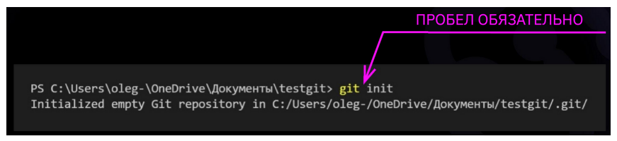

# Инструкция для работы с Git и удалёнными репозиториями

Version 2
## Что такое Git?
    Git - это одна из реализаций распределённых систем контроля версий, имеющая как и локальные, так и удалённые репозитории. Является самой популярной реализацией систем контроля версий в мире. Использует язык Markdown.
Тут page1 ветка
## Что такое Markdown?
    Markdown – язык разметки, который позволяет форматировать текст.
    Все команды задаются при помощи кода в терминале.
Просто git add
## Пример синтаксиса языка Markdown

Первым делом обращаемся к GIT, затем через пробел указывается функция и аргумент при наличии.
git - обращение к GIT.
init - функция вызова инициализации
#
## Подготовка репозитория (Инициализация)
>### Git init
    Для создание репозитория необходимо выполнить команду *git init*  в папке с репозиторием и у Вас создаться репозиторий (появится скрытая папка .git)

## Создание коммитов

> ### Git add
    Для добавления измений в коммит используется команда *git add*. Чтобы использовать команду *git add* напишите *git add <имя файла>*

## Просмотр состояния репозитория
> ### Git status

    Для того, чтобы посмотреть состояние репозитория используется команда *git status*. Для этого необходимо в папке с репозиторием написать *git status*, и Вы увидите были ли измения в файлах, или их не было.
#

## Создание коммитов
> ### Git commit -m " "
    Для того, чтобы создать коммит(сохранение) необходимо выполнить команду *git commit*. Выполняется она так: *git commit -m "<сообщение к коммиту>*. Все файлы для коммита должны быть ***ДОБАВЛЕНЫ*** и сообщение к коммиту писать ***ОБЯЗАТЕЛЬНО***.

## Перемещение между сохранениями
>### Git checkout
    Для того, чтобы перемещаться между коммитами, используется команда *git checkout*. Используется она в папке с пепозиторием следующим образом: *git checkout <номер коммита>*

## Возврат к актуальному состоянию коммита.
>### Git checkout master
>### Git checkout main
    Для того, чтобы вернуться к актуальному состоянию коммита, используется команда *git checkout master*. Используется она в папке с репозиторием следующим образом: *git checkout master* или git checkout main*

## Журнал изменений
>### Git log
    Для того, чтобы посмтреть все сделанные изменения в репозитории, используется команда *git log*. Для этого достаточно выполнить команду *git log* в папке с репозиторием

## Разница между коммитами
>### Git diff
    Для того, чтобы посмотреть разницу между закомиченным файлом в репозитории, используется команда *git diff*.
#
## Ветки в Git

## Создание ветки
>### Git branch
    Для того, чтобы создать ветку, используется команда *git branch*. Делается это следующим образом в папке с репозиторием: *git branch <название новой ветки>*

## Слияние веток
>### Git merge <name branch>
    Для того чтобы дабавить ветку в текущую ветку используется команда *git merge <name branch>*

## Удаление веток
>### Git branch -d 'name branch'
    Для удаления ветки ввести команду "git branch -d 'name branch'"
#

* Жирный текст — \**контент**

* Курсивный текст — \*контент*

* Жирный + курсив - *** контент ***

* Зачеркнутый текст — \~~контент~~

* Заголовок — # в начале строки
Показать уровень заголовка — количество # (от 1 до 6, где 1 - самый главный)

* подчеркивание знаками = или ****

* Нумерованные Списки — обозначаются обычными цифрами 1, 2, 3

* Ненумерованные Списки — обозначаются \*  знаками в начале строки

 * Вложенные Списки — выполняем отступы
